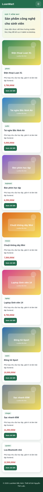
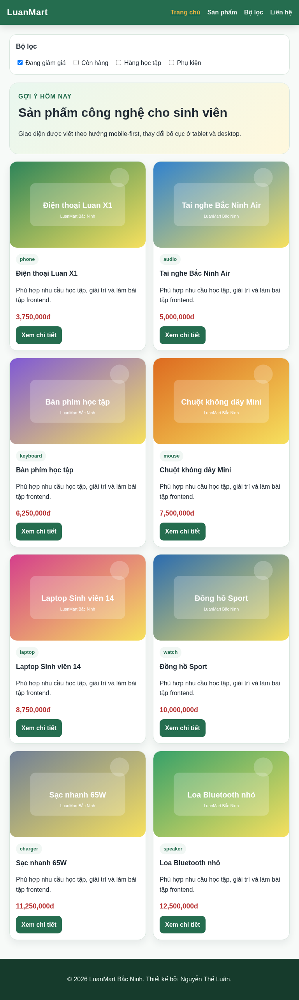
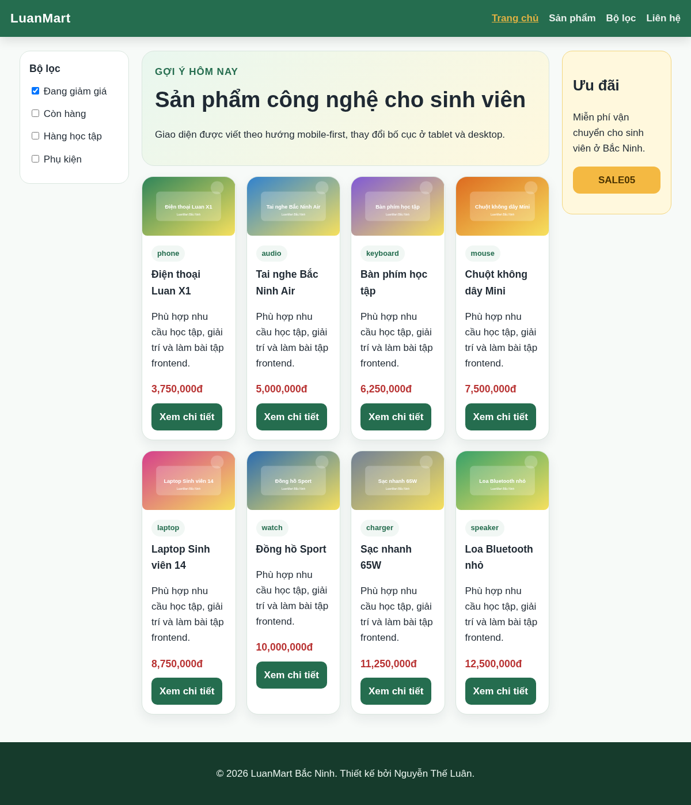
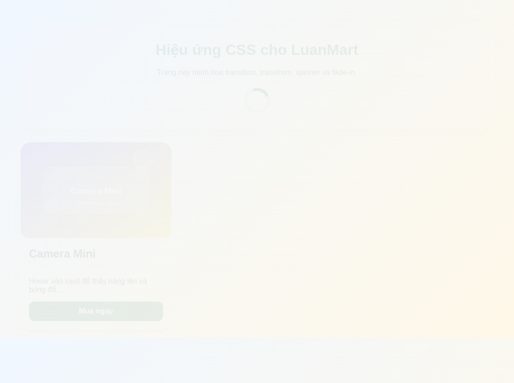
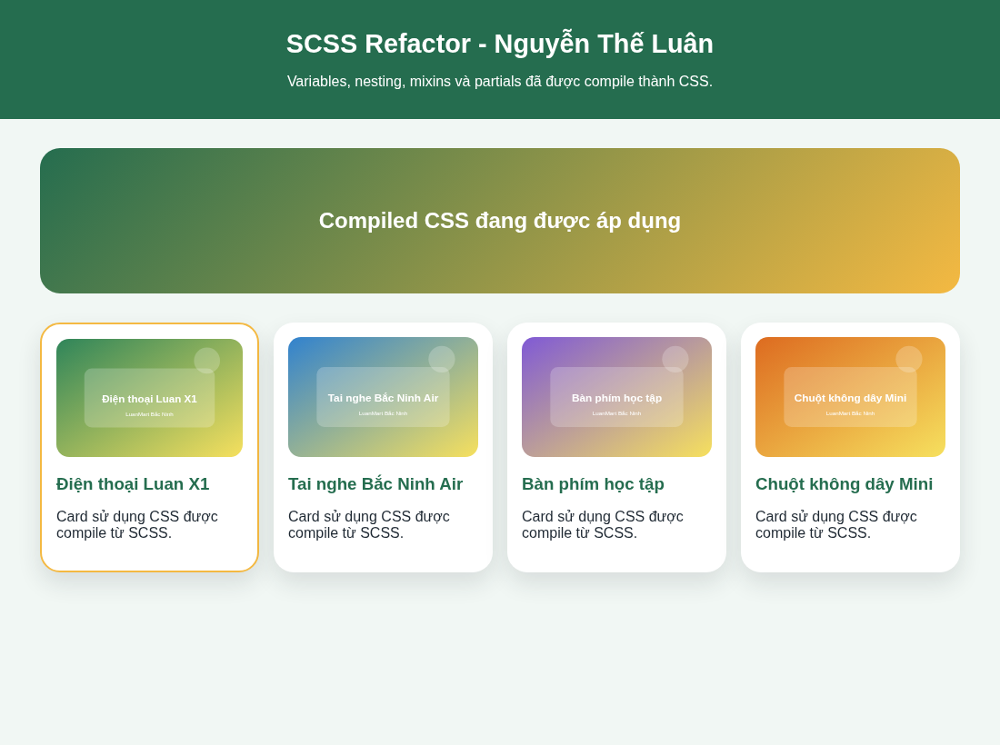
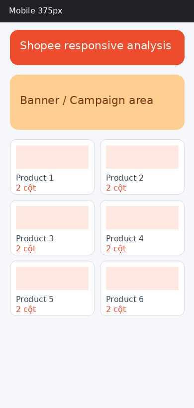
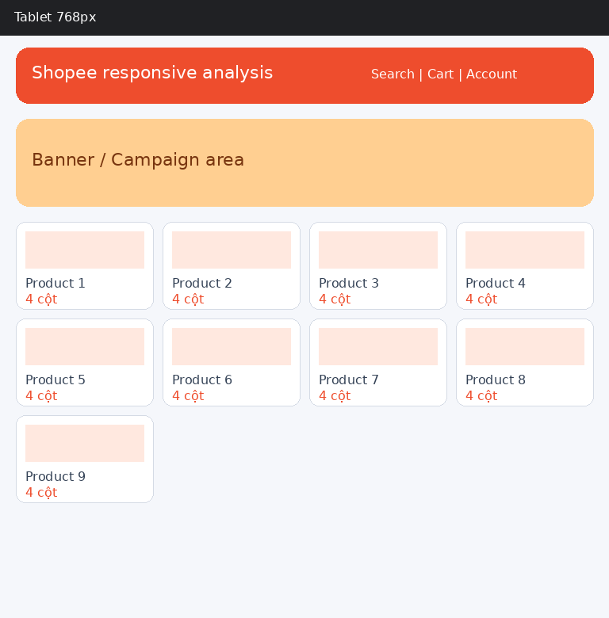
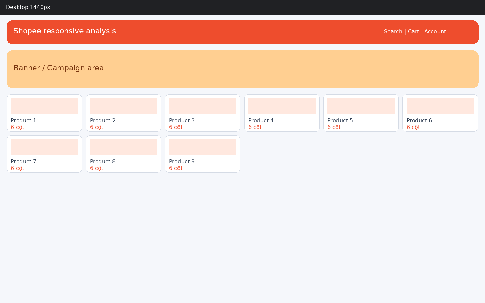
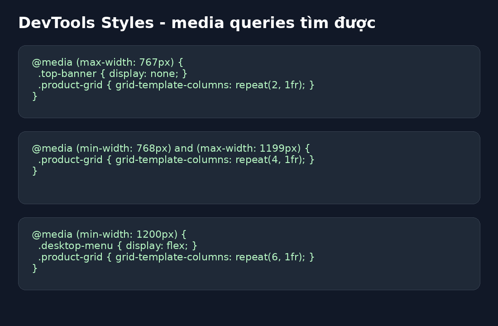
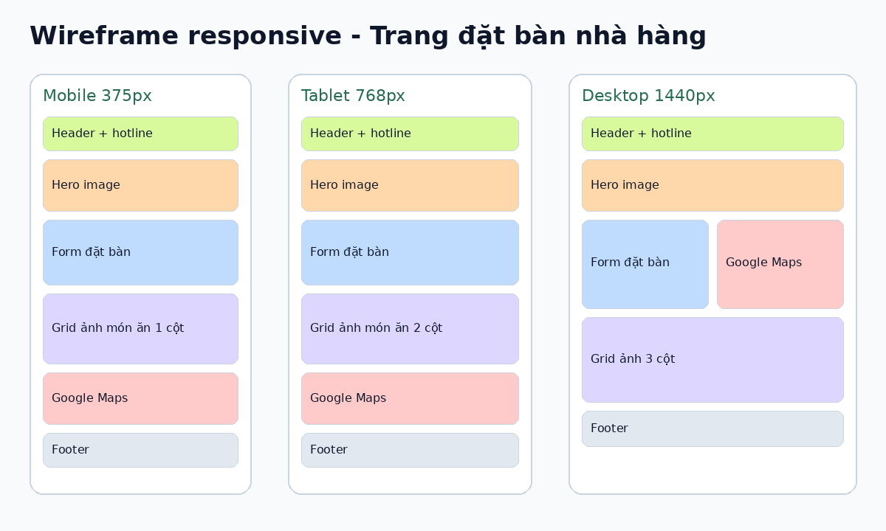

# PBT_05 - CSS Responsive & SCSS

**Họ tên:** Nguyễn Thế Luân  
**Quê quán:** Bắc Ninh

---

## PHẦN A - KIỂM TRA ĐỌC HIỂU

### Câu A1 - Viewport & Mobile-First

Thẻ viewport chuẩn:

```html
<meta name="viewport" content="width=device-width, initial-scale=1.0">
```

`width=device-width` nghĩa là chiều rộng viewport của trang bằng đúng chiều rộng màn hình thiết bị. `initial-scale=1.0` nghĩa là mức zoom ban đầu là 100%.

Nếu thiếu thẻ viewport, iPhone thường coi trang web như một trang desktop rồi thu nhỏ lại để vừa màn hình. Kết quả là chữ nhỏ, nút khó bấm và người dùng phải zoom thủ công.

Mobile-First là viết CSS mặc định cho màn hình nhỏ trước, sau đó dùng `@media (min-width: ...)` để mở rộng layout cho tablet và desktop.

```css
/* Mobile-first */
.product-grid {
    grid-template-columns: 1fr;
}

@media (min-width: 768px) {
    .product-grid {
        grid-template-columns: repeat(2, 1fr);
    }
}
```

Desktop-First là viết CSS mặc định cho desktop trước, sau đó dùng `@media (max-width: ...)` để thu nhỏ layout cho mobile.

```css
/* Desktop-first */
.product-grid {
    grid-template-columns: repeat(4, 1fr);
}

@media (max-width: 768px) {
    .product-grid {
        grid-template-columns: 1fr;
    }
}
```

Mobile-First được khuyên dùng vì hiện nay người dùng truy cập web bằng điện thoại rất nhiều. Cách này giúp trang tải nhẹ hơn trên mobile và dễ mở rộng dần lên các màn hình lớn.

---

### Câu A2 - Breakpoints

| Breakpoint | Kích thước | Thiết bị đại diện | Ví dụ số cột sản phẩm |
|---|---:|---|---:|
| xs | < 576px | Điện thoại dọc | 1 cột |
| sm | ≥ 576px | Điện thoại ngang | 1-2 cột |
| md | ≥ 768px | Tablet | 2 cột |
| lg | ≥ 992px | Desktop nhỏ | 3 cột |
| xl | ≥ 1200px | Desktop lớn | 4 cột |

---

### Câu A3 - Media Queries

```css
.container { width: 100%; padding: 10px; }

@media (min-width: 576px) { .container { width: 540px; } }
@media (min-width: 768px) { .container { width: 720px; } }
@media (min-width: 992px) { .container { width: 960px; } }
@media (min-width: 1200px) { .container { width: 1140px; } }
```

| Chiều rộng màn hình | `.container` width |
|---|---:|
| 375px | 100% |
| 600px | 540px |
| 800px | 720px |
| 1000px | 960px |
| 1400px | 1140px |

Lý do là các media query dùng `min-width`, nên khi màn hình đạt đến breakpoint nào thì rule tương ứng bắt đầu có hiệu lực. Rule nằm sau và cũng thỏa điều kiện sẽ ghi đè rule trước.

---

### Câu A4 - SCSS Basics

SCSS có 4 tính năng chính thường dùng.

1. Variables giúp lưu giá trị dùng lại nhiều lần.

```scss
$primary-color: #256d4f;

.button {
    background: $primary-color;
}
```

2. Nesting giúp viết CSS lồng theo cấu trúc HTML.

```scss
.card {
    h3 {
        color: #256d4f;
    }

    &:hover {
        transform: translateY(-6px);
    }
}
```

3. Mixins giống như hàm dùng lại trong CSS.

```scss
@mixin flex-center {
    display: flex;
    justify-content: center;
    align-items: center;
}

.hero {
    @include flex-center;
}
```

4. `@extend` dùng để kế thừa style từ selector khác.

```scss
.btn {
    padding: 10px 16px;
    border-radius: 8px;
}

.btn-primary {
    @extend .btn;
    background: #256d4f;
}
```

Trình duyệt không đọc trực tiếp file `.scss` vì SCSS là CSS preprocessor, không phải CSS chuẩn của browser. Cần compile SCSS thành CSS rồi mới liên kết file CSS vào HTML.

---

## PHẦN B - THỰC HÀNH CODE

### Bài B1 - Responsive Product Page

File đã tạo:

```text
responsive.html
responsive.css
```

Trang được viết theo hướng mobile-first. CSS mặc định là mobile 1 cột, sau đó dùng `@media (min-width: 768px)` cho tablet và `@media (min-width: 1024px)` cho desktop.

Kết quả màn hình mobile 375px:



Kết quả màn hình tablet 768px:



Kết quả màn hình desktop 1200px:



---

### Bài B2 - CSS Transitions & Animations

File đã tạo:

```text
animations.html
animations.css
```

Trang có đủ 5 hiệu ứng: card hover, button hover, image zoom, loading spinner và fade-in animation.

Kết quả chạy trang animations:



---

### Bài B3 - SCSS Refactor

Cấu trúc SCSS đã tạo:

```text
scss/
├── _variables.scss
├── _mixins.scss
├── _components.scss
├── style.scss
└── style.css
```

Các biến chính được sử dụng gồm màu chủ đạo, màu phụ, font, breakpoint tablet, breakpoint desktop và các khoảng cách spacing.

Lệnh compile SCSS sang CSS:

```bash
sass scss/style.scss scss/style.css
```

Nếu dùng VS Code có thể cài extension Live Sass Compiler rồi bấm Watch Sass để tự compile.

Kết quả CSS compile từ SCSS được áp dụng:



---

## PHẦN C - PHÂN TÍCH

### Câu C1 - Phân tích trang web thực

Em chọn phân tích trang Shopee vì đây là trang thương mại điện tử có lượng nội dung lớn và thường phải tối ưu responsive cho nhiều thiết bị.

Ở màn hình mobile 375px, bố cục thường ưu tiên thanh tìm kiếm, banner và danh sách sản phẩm theo dạng một cột hoặc hai cột nhỏ. Nhiều phần phụ như banner lớn, sidebar hoặc một số liên kết phụ sẽ bị ẩn để tiết kiệm diện tích.



Ở màn hình tablet 768px, nội dung có nhiều không gian hơn nên danh sách sản phẩm có thể tăng số cột. Navigation vẫn cần gọn, nhưng các nhóm nội dung chính đã hiển thị rõ hơn mobile.



Ở màn hình desktop 1440px, trang có đủ không gian để hiển thị header đầy đủ, nhiều banner, nhiều cột sản phẩm và các khu vực phụ.



Navigation thay đổi từ dạng gọn trên mobile sang dạng đầy đủ hơn trên desktop. Lưới sản phẩm tăng từ ít cột lên nhiều cột. Trên mobile, một số banner phụ, sidebar hoặc liên kết phụ thường bị ẩn. Font size có thể tăng nhẹ trên màn hình lớn để dễ đọc hơn.

Media queries thường dùng trong responsive:



---

### Câu C2 - Thiết kế Responsive Strategy

Trang đặt bàn nhà hàng nên dùng mobile-first vì người dùng thường đặt bàn bằng điện thoại. Mobile cần ưu tiên thông tin quan trọng nhất: logo, số điện thoại, hero ngắn, form đặt bàn và bản đồ.

Wireframe 3 kích thước:



Mobile:

```text
HEADER
HERO IMAGE
FORM ĐẶT BÀN
GRID ẢNH 1 CỘT
MAP
FOOTER
```

Tablet:

```text
HEADER
HERO IMAGE
FORM ĐẶT BÀN
GRID ẢNH 2 CỘT
MAP
FOOTER
```

Desktop:

```text
HEADER
HERO IMAGE
MAIN 2 CỘT: FORM + MAP
GRID ẢNH 3 CỘT
FOOTER
```

CSS skeleton:

```css
.restaurant-page {
    display: grid;
    gap: 16px;
}

.food-grid {
    display: grid;
    grid-template-columns: 1fr;
    gap: 16px;
}

.booking-layout {
    display: grid;
    grid-template-columns: 1fr;
    gap: 16px;
}

@media (min-width: 768px) {
    .food-grid {
        grid-template-columns: repeat(2, 1fr);
    }
}

@media (min-width: 1024px) {
    .booking-layout {
        grid-template-columns: 1fr 1fr;
    }

    .food-grid {
        grid-template-columns: repeat(3, 1fr);
    }
}
```

Trên mobile không nên ẩn form đặt bàn vì đây là chức năng chính. Có thể ẩn bớt một số ảnh phụ hoặc phần giới thiệu dài. Tablet dùng grid ảnh 2 cột. Desktop có thể đặt form và bản đồ thành 2 cột để tận dụng chiều ngang.
