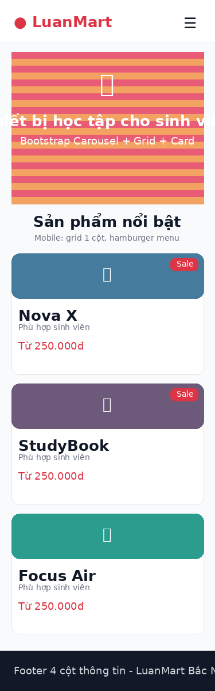
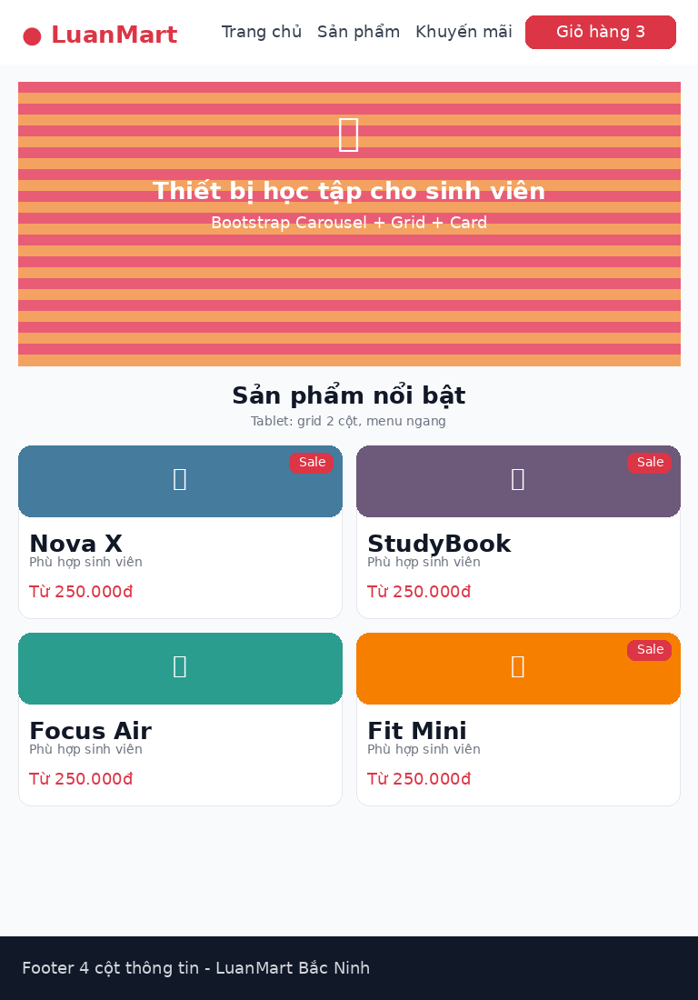
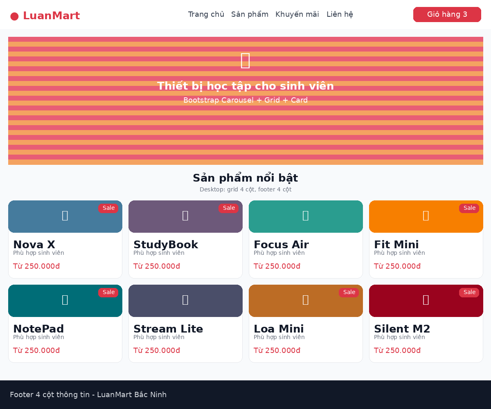
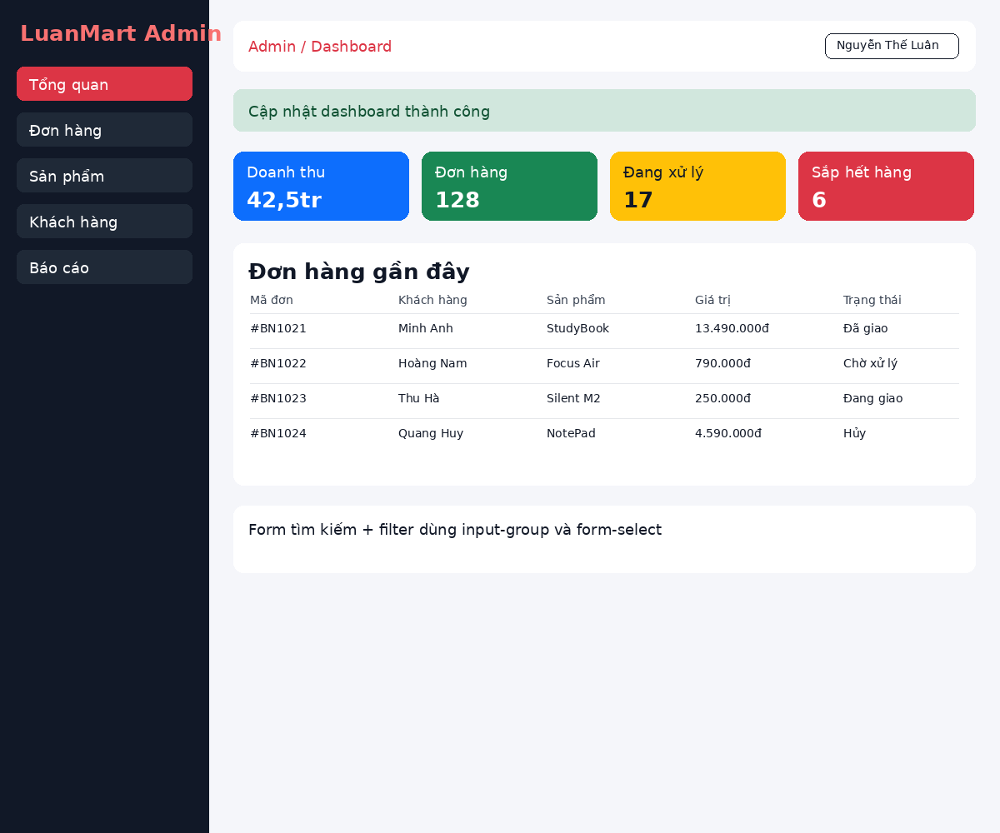
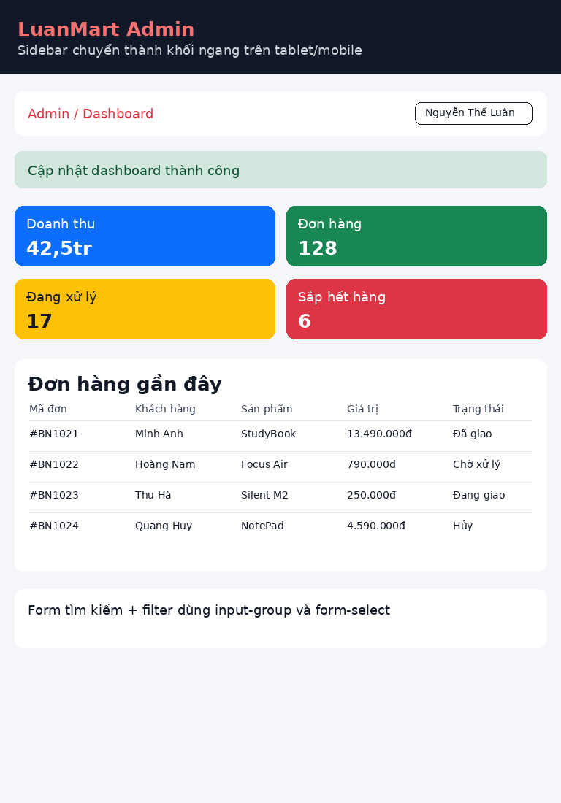

# PBT_06 - CSS Frameworks

**Họ tên:** Nguyễn Thế Luân  
**Quê quán:** Bắc Ninh  
**Track chọn:** Bootstrap 5

## PHẦN A - ĐỌC HIỂU

### Câu A1 - Grid System

Đoạn HTML có 4 box, mỗi box dùng class `col-12 col-md-6 col-lg-3`.

| Kích thước | Số cột | Box layout |
|---|---:|---|
| `< 768px` | 1 cột | Mỗi box chiếm 12/12 cột, 4 box xếp dọc |
| `768px - 991px` | 2 cột | Mỗi box chiếm 6/12 cột, mỗi hàng có 2 box |
| `>= 992px` | 4 cột | Mỗi box chiếm 3/12 cột, 4 box nằm cùng 1 hàng |

Text art:

```text
Mobile:
[Box 1]
[Box 2]
[Box 3]
[Box 4]

Tablet:
[Box 1] [Box 2]
[Box 3] [Box 4]

Desktop:
[Box 1] [Box 2] [Box 3] [Box 4]
```

`col-md-6` nghĩa là từ kích thước `md` trở lên, phần tử chiếm 6/12 cột, tức là một nửa dòng. Không cần viết `col-sm-12` vì `col-12` đã áp dụng mặc định cho mọi kích thước nhỏ hơn breakpoint `md`.

### Câu A2 - Utilities & Components

1. `d-none d-md-block` nghĩa là mặc định phần tử bị ẩn bằng `display: none`. Từ màn hình `md` trở lên, phần tử hiện lại dạng block. Vì vậy trên mobile phần tử bị ẩn, còn trên tablet/desktop thì hiện.

2. Một số spacing utilities:

| Class | Ý nghĩa |
|---|---|
| `mt-3` | margin-top mức 3 |
| `mb-4` | margin-bottom mức 4 |
| `ms-2` | margin-left/start mức 2 |
| `px-4` | padding trái và phải mức 4 |
| `py-5` | padding trên và dưới mức 5 |
| `mb-auto` | margin-bottom tự động |

3. Sự khác nhau giữa container:

| Class | Ý nghĩa |
|---|---|
| `.container` | Có chiều rộng tối đa thay đổi theo breakpoint, căn giữa nội dung |
| `.container-fluid` | Luôn chiếm 100% chiều rộng màn hình |
| `.container-md` | Dưới `md` thì full width, từ `md` trở lên mới có max-width theo container |

## PHẦN B - THỰC HÀNH

### Bài B1 - Landing Page Bootstrap

Trang landing page dùng Bootstrap Navbar, Carousel, Grid, Card, Badge, Modal và Footer 4 cột. Product grid hiển thị 1 cột trên mobile, 2 cột trên tablet và 4 cột trên desktop.

Ảnh chụp mobile 375px:



Ảnh chụp tablet 768px:



Ảnh chụp desktop 1200px:



### Bài B2 - Dashboard Layout

Trang dashboard dùng sidebar cố định, topbar có breadcrumb và dropdown, stat cards, bảng đơn hàng, form filter, accordion và alert thông báo.

Ảnh chụp dashboard desktop:



Ảnh chụp dashboard tablet/mobile:



## PHẦN C - PHÂN TÍCH

### Câu C1 - Tùy biến Bootstrap

Muốn đổi màu `$primary` của Bootstrap từ xanh mặc định sang `#E63946`, không nên sửa trực tiếp file CSS đã build sẵn. Quy trình hợp lý là dùng Bootstrap source Sass, tạo file Sass riêng, khai báo lại biến trước khi import Bootstrap rồi compile sang CSS.

Ví dụ:

```scss
$primary: #E63946;
$border-radius: .75rem;

@import "bootstrap/scss/bootstrap";
```

Cần công cụ compile Sass như npm package `sass`, Vite, Webpack hoặc Live Sass Compiler. Sau khi compile, website dùng file CSS mới đã có màu primary được tùy biến.

Không nên override trực tiếp `.btn-primary { background: red; }` vì cách này chỉ sửa một component cụ thể. Bootstrap còn dùng `$primary` cho button, link, badge, alert, border, focus ring và nhiều utilities khác. Dùng Sass variables giúp giao diện đồng bộ hơn, dễ bảo trì hơn và ít gây lỗi chồng CSS.

### Câu C2 - So sánh Bootstrap với CSS thuần

Ví dụ CSS thuần để tạo navbar responsive và product card:

```css
.navbar {
    display: flex;
    justify-content: space-between;
    align-items: center;
    padding: 16px 32px;
    background: white;
    box-shadow: 0 2px 8px rgba(0,0,0,0.08);
}

.menu {
    display: flex;
    gap: 24px;
}

.card {
    border: 1px solid #ddd;
    border-radius: 12px;
    overflow: hidden;
    box-shadow: 0 4px 12px rgba(0,0,0,0.08);
}

.card img {
    width: 100%;
    height: 190px;
    object-fit: cover;
}

@media (max-width: 768px) {
    .menu { display: none; }
    .card { margin-bottom: 16px; }
}
```

So sánh:

| Tiêu chí | CSS thuần | Bootstrap |
|---|---|---|
| Số dòng CSS | Nhiều hơn vì phải tự viết layout, spacing, responsive | Ít hơn vì dùng class có sẵn |
| Thời gian phát triển | Lâu hơn | Nhanh hơn, nhất là với navbar, modal, card, table |
| Khả năng tùy biến | Rất cao, tự do theo thiết kế | Có thể bị giống giao diện Bootstrap nếu không tùy biến |
| Phù hợp | Website cần thiết kế riêng, ít phụ thuộc framework | Prototype nhanh, dashboard, admin panel, dự án nhỏ |

Nên dùng Bootstrap khi cần làm nhanh, cần component sẵn như modal, dropdown, accordion, carousel. Không nên dùng Bootstrap khi dự án yêu cầu giao diện rất riêng, cần tối ưu dung lượng cao hoặc team muốn kiểm soát toàn bộ design system.
