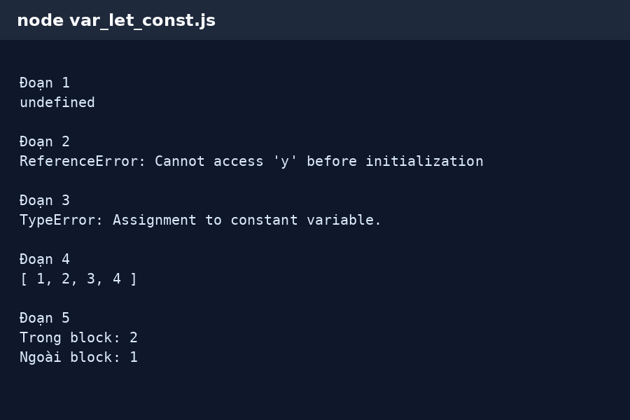
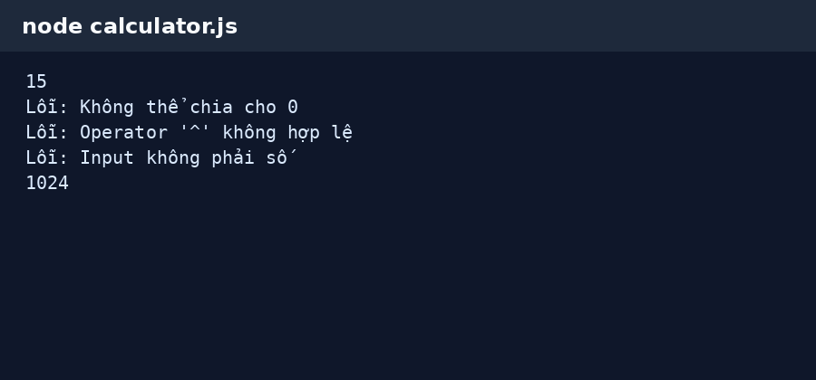
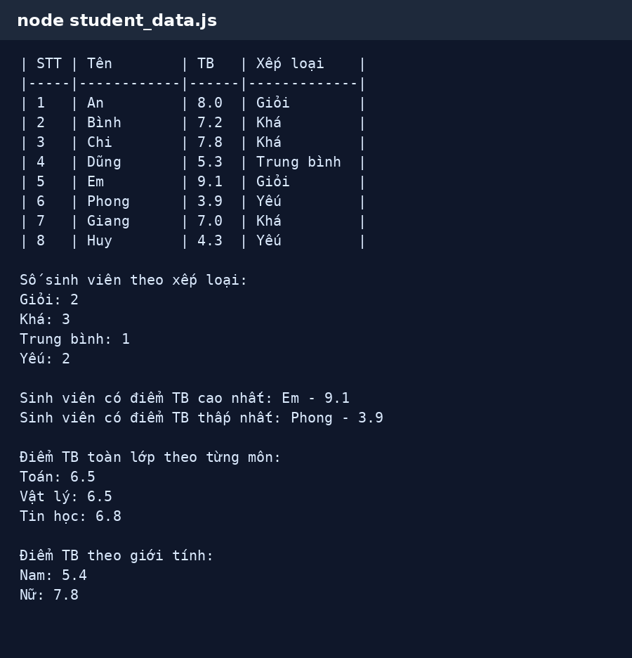
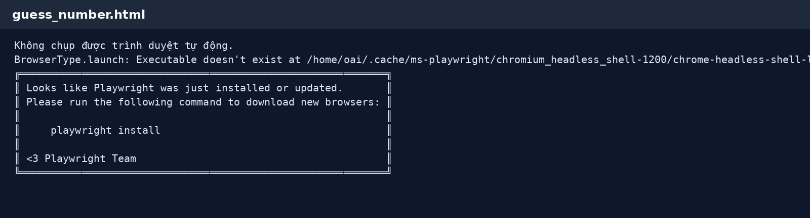
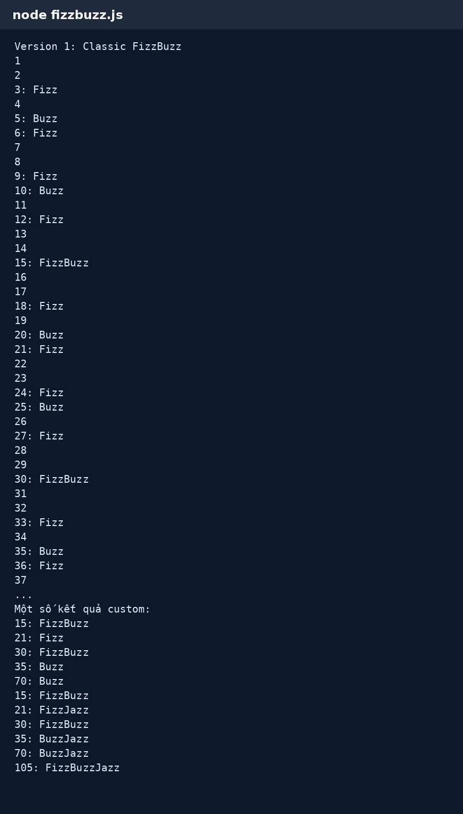
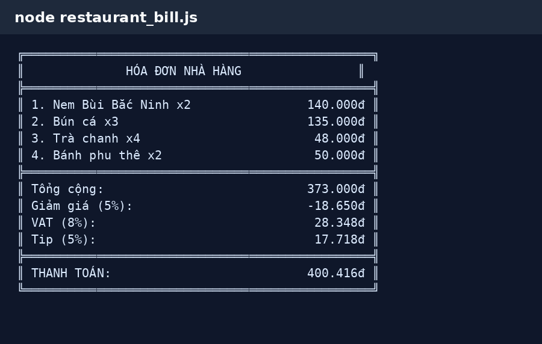

# PBT_07 - JavaScript Basics

**Họ tên:** Nguyễn Thế Luân  
**Quê quán:** Bắc Ninh

---

## PHẦN A - KIỂM TRA ĐỌC HIỂU

### Câu A1 - var / let / const

#### Đoạn 1

```javascript
console.log(x);
var x = 5;
```

Kết quả dự đoán:

```text
undefined
```

Biến khai báo bằng `var` có hoisting. Biến được đưa lên đầu phạm vi nhưng giá trị chưa được gán, nên khi in ra trước dòng gán thì kết quả là `undefined`.

#### Đoạn 2

```javascript
console.log(y);
let y = 10;
```

Kết quả dự đoán:

```text
ReferenceError
```

Biến khai báo bằng `let` không được sử dụng trước khi khai báo. Vùng trước dòng khai báo là Temporal Dead Zone.

#### Đoạn 3

```javascript
const z = 15;
z = 20;
console.log(z);
```

Kết quả dự đoán:

```text
TypeError
```

Biến `const` không thể gán lại giá trị mới. Vì vậy dòng `z = 20` gây lỗi.

#### Đoạn 4

```javascript
const arr = [1, 2, 3];
arr.push(4);
console.log(arr);
```

Kết quả dự đoán:

```text
[1, 2, 3, 4]
```

`const` không cho gán lại biến sang mảng khác, nhưng vẫn có thể thay đổi nội dung bên trong mảng.

#### Đoạn 5

```javascript
let a = 1;
{
    let a = 2;
    console.log("Trong block:", a);
}
console.log("Ngoài block:", a);
```

Kết quả dự đoán:

```text
Trong block: 2
Ngoài block: 1
```

Biến `a` trong block và ngoài block là hai biến khác nhau vì `let` có phạm vi theo block.

Kết quả kiểm chứng:



---

### Câu A2 - Data Types & Coercion

```javascript
console.log(typeof null);              // object
console.log(typeof undefined);         // undefined
console.log(typeof NaN);               // number
console.log("5" + 3);                  // "53"
console.log("5" - 3);                  // 2
console.log("5" * "3");                // 15
console.log(true + true);              // 2
console.log([] + []);                  // ""
console.log([] + {});                  // "[object Object]"
console.log({} + []);                  // "[object Object]" hoặc 0 tùy môi trường chạy
```

`typeof null` trả về `object` là một điểm đặc biệt lịch sử của JavaScript. `NaN` là một giá trị số không hợp lệ nên `typeof NaN` là `number`.

`"5" + 3` cho ra `"53"` vì toán tử `+` có thể dùng để nối chuỗi. Khi có chuỗi, JavaScript chuyển `3` thành chuỗi rồi nối lại.

`"5" - 3` cho ra `2` vì toán tử `-` chỉ dùng cho phép toán số học. JavaScript tự ép chuỗi `"5"` thành số `5` rồi trừ đi `3`.

---

### Câu A3 - So sánh `==` và `===`

```javascript
console.log(5 == "5");                // true
console.log(5 === "5");               // false
console.log(null == undefined);       // true
console.log(null === undefined);      // false
console.log(NaN == NaN);              // false
console.log(0 == false);              // true
console.log(0 === false);             // false
console.log("" == false);             // true
```

Từ giờ nên dùng `===` thay vì `==`.

Lý do là `===` so sánh cả giá trị và kiểu dữ liệu, kết quả rõ ràng hơn. `==` có ép kiểu ngầm nên dễ tạo ra kết quả khó đoán.

---

### Câu A4 - Truthy & Falsy

Các giá trị falsy trong JavaScript gồm:

```text
false
0
-0
0n
""
null
undefined
NaN
```

Dự đoán kết quả:

```javascript
if ("0") console.log("A");           // Có in
if ("") console.log("B");            // Không in
if ([]) console.log("C");            // Có in
if ({}) console.log("D");            // Có in
if (null) console.log("E");          // Không in
if (0) console.log("F");             // Không in
if (-1) console.log("G");            // Có in
if (" ") console.log("H");           // Có in
```

Kết quả in ra:

```text
A
C
D
G
H
```

Chuỗi `"0"` và chuỗi có dấu cách `" "` là truthy vì không phải chuỗi rỗng. Mảng rỗng và object rỗng cũng là truthy.

---

### Câu A5 - Template Literals

#### Cách 1

```javascript
var greeting = `Xin chào ${name}! Bạn ${age} tuổi.`;
```

#### Cách 2

```javascript
var url = `https://api.example.com/users/${userId}/orders?page=${page}`;
```

#### Cách 3

```javascript
var html = `
<div class="card">
    <h2>${title}</h2>
    <p>${description}</p>
    <span>Giá: ${price}đ</span>
</div>`;
```

---

## PHẦN B - MINH CHỨNG CHẠY CODE

### Bài B1 - Máy tính đơn giản

Kết quả chạy file `calculator.js`:



### Bài B2 - Xử lý dữ liệu sinh viên

Kết quả chạy file `student_data.js`:



### Bài B3 - Mini Game đoán số

Giao diện mở file `guess_number.html` trên trình duyệt:



### Bài B4 - FizzBuzz nâng cao

Kết quả chạy file `fizzbuzz.js`:



---

## PHẦN C - SUY LUẬN

### Câu C1 - Debug JavaScript

Các lỗi trong đoạn code:

1. Dòng `if (giaSauGiam = 0)` dùng phép gán `=` thay vì phép so sánh.
2. Hàm chưa kiểm tra `giaBan` có phải là số hay không.
3. Hàm chưa kiểm tra `phanTramGiam` có phải là số hay không.
4. Giá bán nên lớn hơn 0, không nên cho phép giá âm hoặc bằng 0.
5. Test truyền `"100000"` là chuỗi, không phải số.
6. Dùng `var` trong vòng lặp với `setTimeout` làm các lần in dùng chung một biến `i`.
7. Nên dùng `const` cho các biến không gán lại như `giamGia`, `giaSauGiam`.
8. Nên thêm dấu chấm phẩy để code rõ ràng hơn.

Code đã sửa:

```javascript
function tinhGiaGiamGia(giaBan, phanTramGiam) {
    if (typeof giaBan !== "number" || Number.isNaN(giaBan) || giaBan <= 0) {
        return "Giá bán không hợp lệ";
    }

    if (typeof phanTramGiam !== "number" || Number.isNaN(phanTramGiam)) {
        return "Phần trăm giảm không hợp lệ";
    }

    if (phanTramGiam < 0 || phanTramGiam > 100) {
        return "Phần trăm giảm không hợp lệ";
    }

    const giamGia = giaBan * phanTramGiam / 100;
    const giaSauGiam = giaBan - giamGia;

    if (giaSauGiam === 0) {
        console.log("Sản phẩm miễn phí!");
    }

    return giaSauGiam;
}

const gia = tinhGiaGiamGia(100000, 20);
console.log("Giá sau giảm: " + gia + "đ");

const gia2 = tinhGiaGiamGia(50000, 110);
console.log("Giá: " + gia2);

for (let i = 0; i < 5; i++) {
    setTimeout(function() {
        console.log("Item " + i);
    }, 1000);
}
```

Lỗi ẩn trong vòng lặp là do `var` có phạm vi function scope. Khi `setTimeout` chạy, vòng lặp đã kết thúc và biến `i` có giá trị cuối cùng là 5, nên có thể in ra `Item 5` nhiều lần. Khi đổi sang `let`, mỗi vòng lặp có một biến `i` riêng theo block scope nên kết quả in đúng từ `Item 0` đến `Item 4`.

### Câu C2 - Bài toán thực tế

Chương trình tính hóa đơn nhà hàng đã được viết trong file `restaurant_bill.js`.

Kết quả chạy chương trình:


