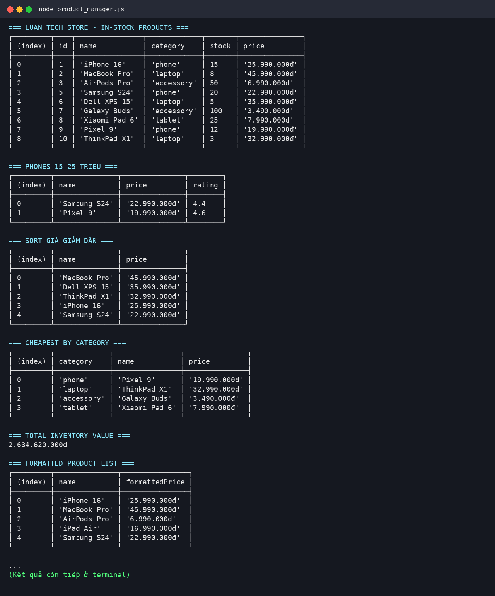
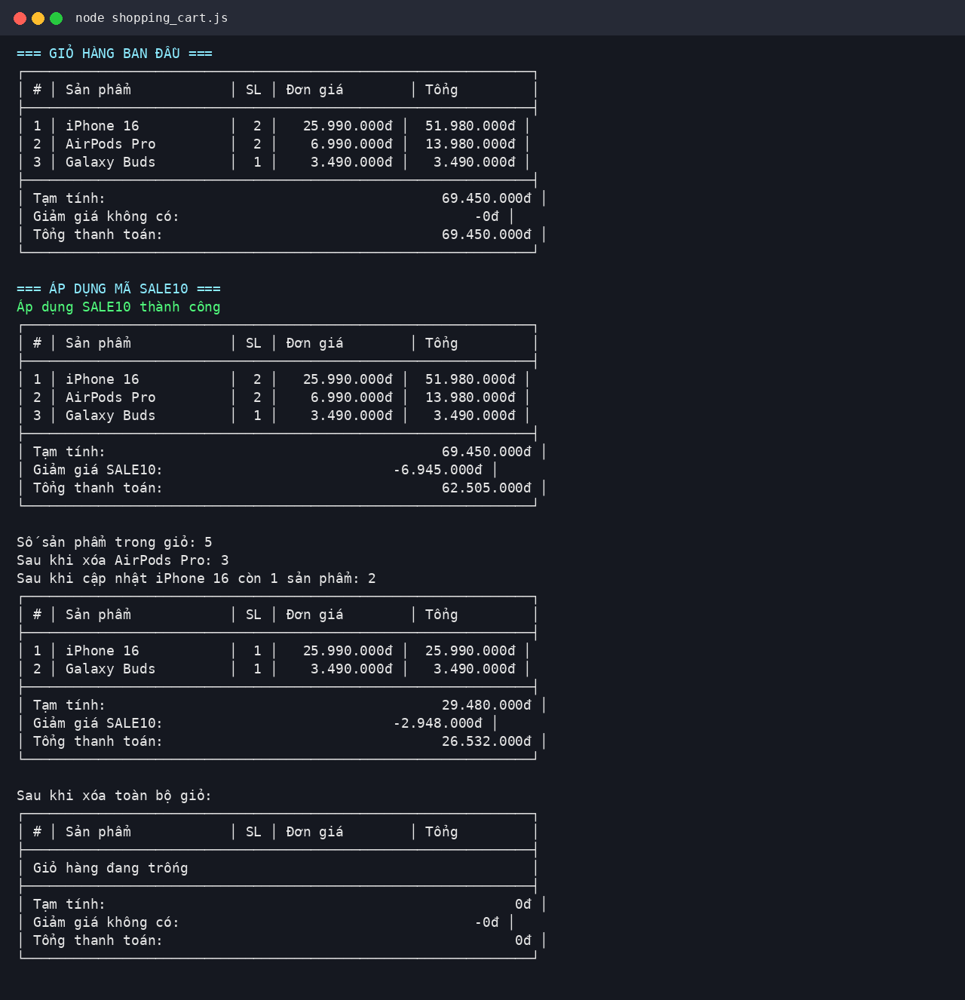
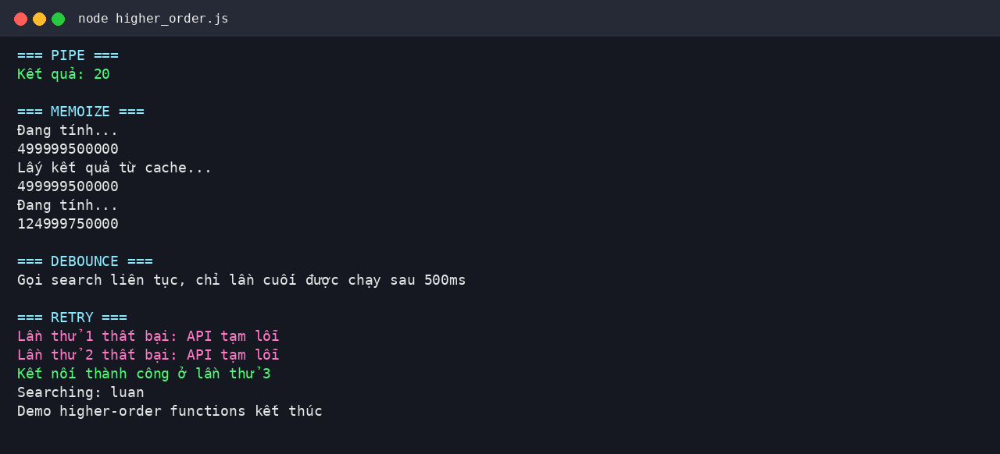

# PBT_08 - JavaScript Functions, Arrays & Objects

**Họ tên:** Nguyễn Thế Luân  
**Quê quán:** Bắc Ninh

---

## PHẦN A - KIỂM TRA ĐỌC HIỂU

### Câu A1 - Function Declaration vs Expression vs Arrow

#### Cách 1: Function Declaration

```javascript
function tinhThueBaoHiem(luong) {
    const thuong = luong > 11000000 ? luong * 0.1 : 0;
    const thuc_nhan = luong - thuong;
    return { thuong, thuc_nhan };
}
```

#### Cách 2: Function Expression

```javascript
const tinhThueBaoHiem = function(luong) {
    const thuong = luong > 11000000 ? luong * 0.1 : 0;
    const thuc_nhan = luong - thuong;
    return { thuong, thuc_nhan };
};
```

#### Cách 3: Arrow Function

```javascript
const tinhThueBaoHiem = (luong) => {
    const thuong = luong > 11000000 ? luong * 0.1 : 0;
    const thuc_nhan = luong - thuong;
    return { thuong, thuc_nhan };
};
```

Ba cách khai báo hàm này có khác nhau về hoisting.

Function Declaration được hoisting đầy đủ nên có thể gọi hàm trước khi khai báo:

```javascript
console.log(tinhThueBaoHiem(15000000));

function tinhThueBaoHiem(luong) {
    const thuong = luong > 11000000 ? luong * 0.1 : 0;
    const thuc_nhan = luong - thuong;
    return { thuong, thuc_nhan };
}
```

Function Expression và Arrow Function thường được gán vào biến `const` hoặc `let`, nên không thể gọi trước khi khai báo. Nếu gọi trước sẽ gặp lỗi ReferenceError do Temporal Dead Zone.

```javascript
console.log(tinhThueBaoHiem(15000000));

const tinhThueBaoHiem = function(luong) {
    const thuong = luong > 11000000 ? luong * 0.1 : 0;
    const thuc_nhan = luong - thuong;
    return { thuong, thuc_nhan };
};
```

```javascript
console.log(tinhThueBaoHiem(15000000));

const tinhThueBaoHiem = (luong) => {
    const thuong = luong > 11000000 ? luong * 0.1 : 0;
    const thuc_nhan = luong - thuong;
    return { thuong, thuc_nhan };
};
```

---

### Câu A2 - Scope & Closure

#### Đoạn 1

```javascript
function counter() {
    let count = 0;
    return {
        increment: () => ++count,
        decrement: () => --count,
        getCount: () => count
    };
}
const c = counter();
console.log(c.increment());
console.log(c.increment());
console.log(c.increment());
console.log(c.decrement());
console.log(c.getCount());
```

Kết quả dự đoán:

```text
1
2
3
2
2
```

Hàm `counter()` tạo biến `count` bên trong. Các hàm `increment`, `decrement`, `getCount` vẫn nhớ và truy cập được biến `count` đó, dù `counter()` đã chạy xong. Đây là closure.

#### Đoạn 2

```javascript
for (var i = 0; i < 3; i++) {
    setTimeout(() => console.log("var:", i), 100);
}
for (let j = 0; j < 3; j++) {
    setTimeout(() => console.log("let:", j), 200);
}
```

Kết quả dự đoán:

```text
var: 3
var: 3
var: 3
let: 0
let: 1
let: 2
```

`var` có phạm vi function scope nên cả 3 callback dùng chung một biến `i`. Khi `setTimeout` chạy thì vòng lặp đã kết thúc, lúc đó `i = 3`.

`let` có block scope nên mỗi vòng lặp tạo ra một biến `j` riêng. Vì vậy callback nhớ đúng giá trị của từng lượt lặp là `0`, `1`, `2`.

---

### Câu A3 - Array Methods

Cho mảng:

```javascript
const nums = [1, 2, 3, 4, 5, 6, 7, 8, 9, 10];
```

1. Lấy các số chẵn:

```javascript
const evenNums = nums.filter(n => n % 2 === 0);
```

2. Nhân mỗi số với 3:

```javascript
const tripleNums = nums.map(n => n * 3);
```

3. Tính tổng tất cả:

```javascript
const total = nums.reduce((sum, n) => sum + n, 0);
```

4. Tìm số đầu tiên lớn hơn 7:

```javascript
const firstGreaterThanSeven = nums.find(n => n > 7);
```

5. Kiểm tra có số lớn hơn 10 không:

```javascript
const hasGreaterThanTen = nums.some(n => n > 10);
```

6. Kiểm tra tất cả đều lớn hơn 0:

```javascript
const allPositive = nums.every(n => n > 0);
```

7. Tạo mảng mô tả chẵn lẻ:

```javascript
const labels = nums.map(n => `Số ${n} là ${n % 2 === 0 ? "chẵn" : "lẻ"}`);
```

8. Đảo ngược mảng nhưng không làm thay đổi mảng gốc:

```javascript
const reversed = [...nums].reverse();
```

---

### Câu A4 - Object Destructuring & Spread

```javascript
const product = {
    name: "iPhone 16",
    price: 25990000,
    specs: { ram: 8, storage: 256, color: "Titan" }
};

const { name, price, specs: { ram, color } } = product;
console.log(name, price, ram, color);
console.log(specs);
```

Dòng đầu tiên in ra:

```text
iPhone 16 25990000 8 Titan
```

Dòng `console.log(specs)` gây lỗi:

```text
ReferenceError: specs is not defined
```

Lý do là trong destructuring lồng nhau, `specs: { ram, color }` chỉ lấy ra `ram` và `color`, không tạo biến tên `specs`.

Nếu bỏ dòng gây lỗi và chạy phần spread:

```javascript
const updated = { ...product, price: 23990000, sale: true };
console.log(updated.price);
console.log(updated.sale);
console.log(product.price);
```

Kết quả:

```text
23990000
true
25990000
```

Object `updated` là object mới, nên khi sửa `price` trong `updated` thì `product.price` gốc không đổi.

```javascript
const copy = { ...product };
copy.specs.ram = 16;
console.log(product.specs.ram);
```

Kết quả:

```text
16
```

Lý do là spread object chỉ copy nông. Thuộc tính `specs` là object lồng bên trong nên `copy.specs` và `product.specs` vẫn cùng tham chiếu đến một object.

---

## PHẦN B - THỰC HÀNH CODE

### Bài B1 - Quản lý sản phẩm E-Commerce

File thực hiện: `product_manager.js`

Kết quả chạy chương trình:



### Bài B2 - Giỏ hàng Shopping Cart

File thực hiện: `shopping_cart.js`

Kết quả chạy chương trình:



### Bài B3 - Higher-Order Functions Challenge

File thực hiện: `higher_order.js`

Kết quả chạy chương trình:



---

## PHẦN C - SUY LUẬN

### Câu C1 - Refactor Code

Code sau khi refactor:

```javascript
const processOrders = orders => orders
    .filter(({ status, total }) => status === "completed" && total > 100000)
    .map(({ id, customer, total }) => {
        const discount = total * 0.1;
        return { id, customer, total, discount, finalTotal: total - discount };
    })
    .sort((a, b) => b.finalTotal - a.finalTotal);
```

Đoạn code trên dùng `filter` để lọc đơn hàng đã hoàn thành và có tổng tiền lớn hơn 100000. Sau đó dùng `map` để tạo object mới gồm `id`, `customer`, `total`, `discount`, `finalTotal`. Cuối cùng dùng `sort` để sắp xếp theo `finalTotal` giảm dần.

---

### Câu C2 - Thiết kế API miniArray

```javascript
const miniArray = {
    map(arr, fn) {
        const result = [];
        for (let i = 0; i < arr.length; i++) {
            result.push(fn(arr[i], i, arr));
        }
        return result;
    },

    filter(arr, fn) {
        const result = [];
        for (let i = 0; i < arr.length; i++) {
            if (fn(arr[i], i, arr)) {
                result.push(arr[i]);
            }
        }
        return result;
    },

    reduce(arr, fn, initialValue) {
        let accumulator = initialValue;
        let startIndex = 0;

        if (accumulator === undefined) {
            accumulator = arr[0];
            startIndex = 1;
        }

        for (let i = startIndex; i < arr.length; i++) {
            accumulator = fn(accumulator, arr[i], i, arr);
        }

        return accumulator;
    }
};

console.log(miniArray.map([1, 2, 3], x => x * 2));
console.log(miniArray.filter([1, 2, 3, 4], x => x > 2));
console.log(miniArray.reduce([1, 2, 3, 4], (a, b) => a + b, 0));
```

Kết quả mong muốn:

```text
[2, 4, 6]
[3, 4]
10
```

Hàm `map` tạo ra mảng mới sau khi biến đổi từng phần tử. Hàm `filter` tạo ra mảng mới gồm các phần tử thỏa điều kiện. Hàm `reduce` gom các phần tử trong mảng thành một giá trị cuối cùng.
