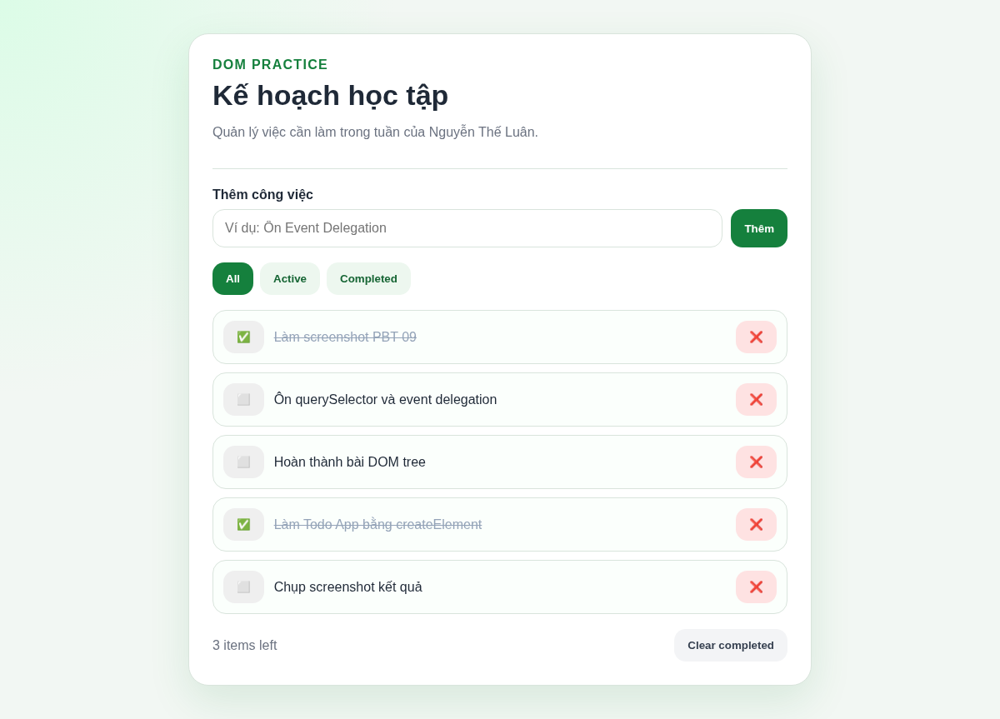
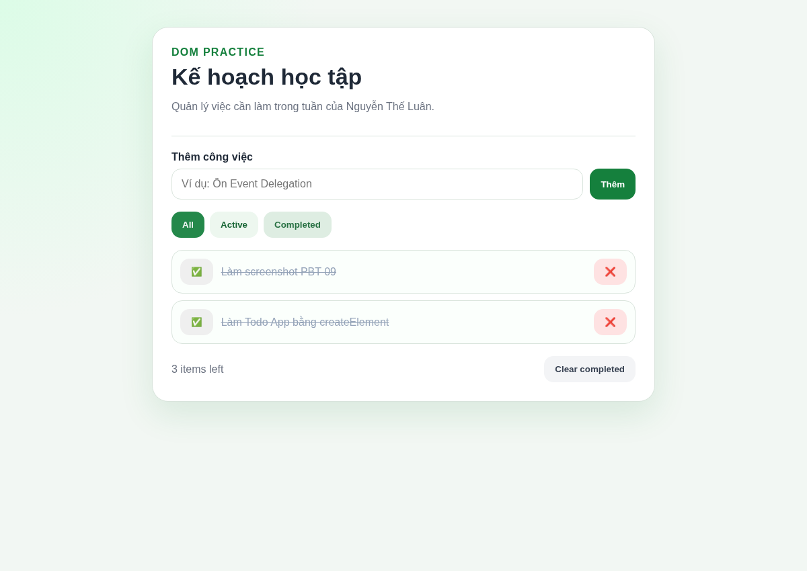
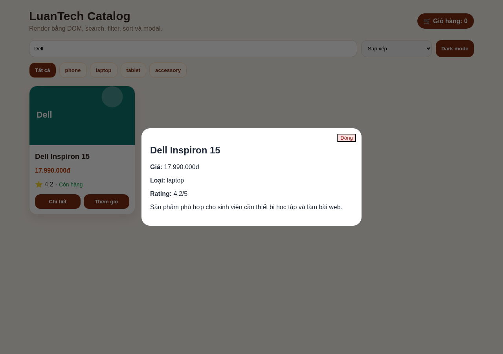
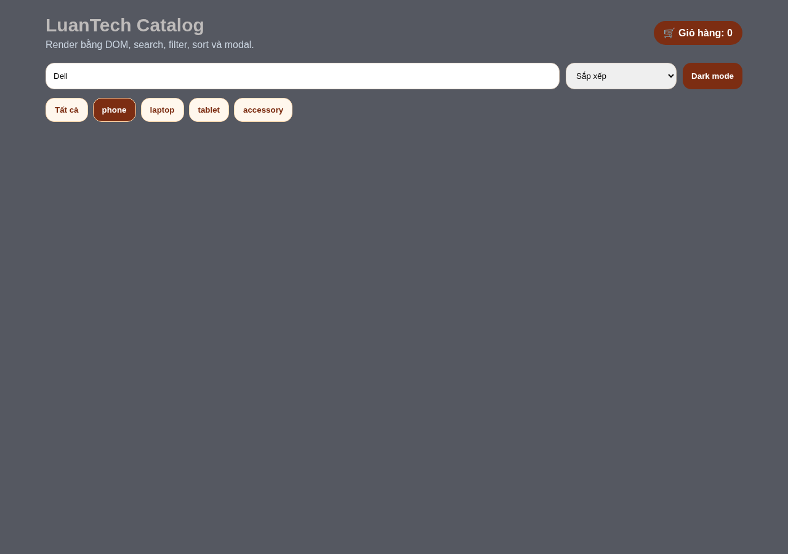
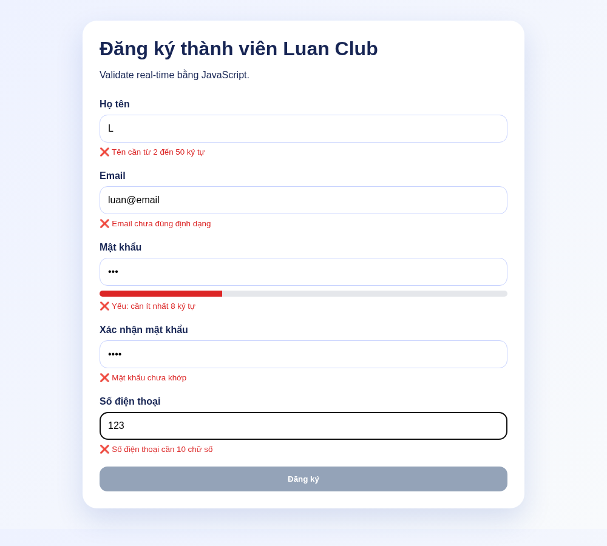
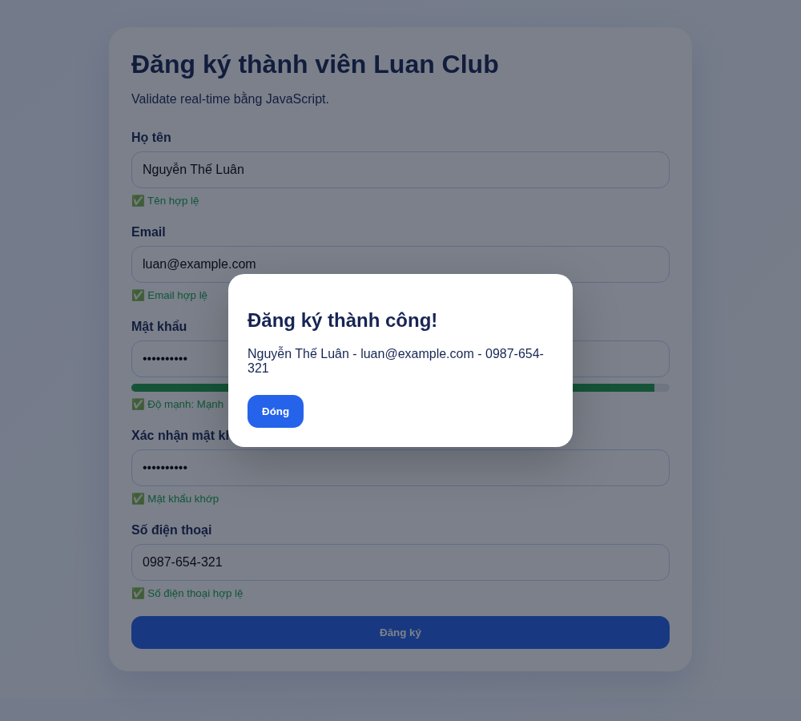
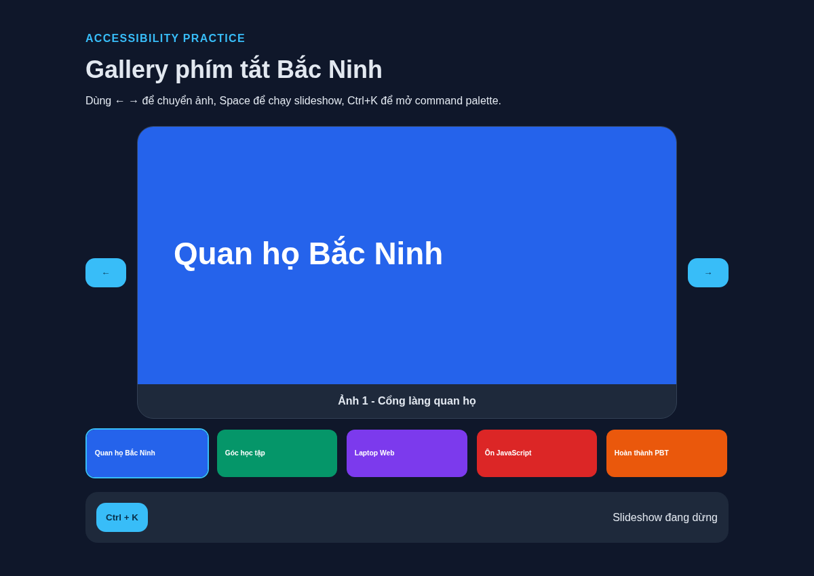
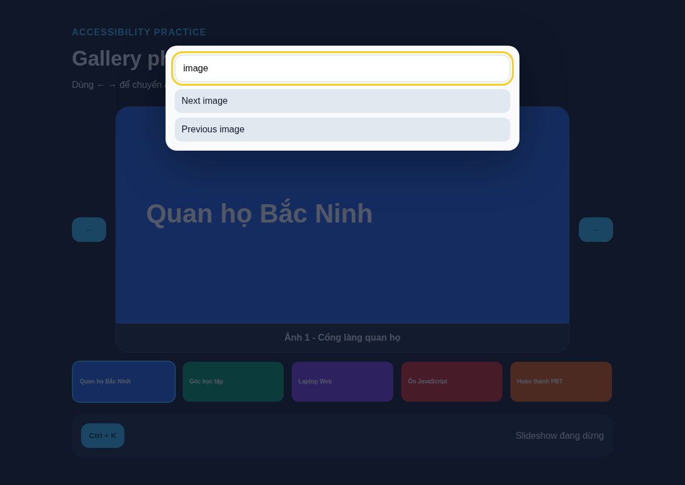

# PBT_09 - DOM Manipulation & Events

**Họ tên:** Nguyễn Thế Luân  
**Quê quán:** Bắc Ninh

---

## PHẦN A - KIỂM TRA ĐỌC HIỂU

### Câu A1 - DOM Tree

DOM tree của đoạn HTML:

```text
document
└── html
    └── body
        └── div#app
            ├── header
            │   ├── h1
            │   │   └── "Todo App"
            │   └── nav
            │       ├── a.active
            │       │   └── "All"
            │       ├── a
            │       │   └── "Active"
            │       └── a
            │           └── "Completed"
            └── main
                ├── form#todoForm
                │   ├── input#todoInput
                │   └── button[type="submit"]
                │       └── "Add"
                └── ul#todoList
                    ├── li.todo-item
                    │   └── "Learn HTML"
                    └── li.todo-item.completed
                        └── "Learn CSS"
```

Các câu lệnh `querySelector`:

```javascript
const title = document.querySelector("h1");
const input = document.querySelector("#todoForm input");
const todoItems = document.querySelectorAll(".todo-item");
const activeLink = document.querySelector("nav a.active");
const firstTodo = document.querySelector("#todoList li:first-child");
const navLinks = document.querySelectorAll("nav a");
```

---

### Câu A2 - innerHTML vs textContent

`textContent` dùng để lấy hoặc gán nội dung dạng văn bản thuần. Nếu nội dung có thẻ HTML thì trình duyệt vẫn hiển thị như chữ bình thường, không biến thành thẻ thật.

`innerHTML` dùng để lấy hoặc gán nội dung HTML bên trong một phần tử. Nếu chuỗi có thẻ HTML, trình duyệt sẽ phân tích và render thành phần tử HTML.

Ví dụ dùng `textContent`:

```javascript
document.querySelector("#message").textContent = "Xin chào Nguyễn Thế Luân";
```

Ví dụ dùng `innerHTML`:

```javascript
document.querySelector("#message").innerHTML = "<strong>Đăng ký thành công</strong>";
```

`innerHTML` có thể gây lỗi XSS vì nếu đưa dữ liệu người dùng nhập trực tiếp vào HTML, người dùng có thể chèn mã độc như thẻ `` có `onerror`, hoặc các đoạn script để chạy trong trình duyệt.

Code nguy hiểm:

```javascript
const userInput = document.querySelector("#search").value;
document.querySelector("#result").innerHTML = userInput;
```

Cách sửa an toàn hơn:

```javascript
const userInput = document.querySelector("#search").value;
document.querySelector("#result").textContent = userInput;
```

---

### Câu A3 - Event Bubbling

Khi click vào button, event xảy ra tại button trước, sau đó nổi dần lên phần tử cha là `#inner`, rồi tiếp tục lên `#outer`.

Output khi click vào button:

```text
BUTTON
INNER
OUTER
```

Nếu bỏ comment dòng `e.stopPropagation()` trong handler của button:

```javascript
e.stopPropagation();
```

thì event không nổi tiếp lên cha nữa. Output chỉ còn:

```text
BUTTON
```

---

## PHẦN B - THỰC HÀNH CODE

### Bài B1 - Todo App hoàn chỉnh

Todo App có thể thêm công việc, xóa công việc, đánh dấu hoàn thành, lọc All/Active/Completed, clear completed, double-click để sửa và lưu bằng LocalStorage.

Kết quả giao diện chính:



Kết quả khi lọc danh sách completed:



---

### Bài B2 - Interactive Product Catalog

Product Catalog render sản phẩm hoàn toàn bằng JavaScript, có tìm kiếm realtime, lọc category, sort, modal chi tiết, badge giỏ hàng và dark mode.

Kết quả tìm kiếm và modal chi tiết sản phẩm:



Kết quả dark mode và filter category:



---

### Bài B3 - Form Validator

Form Validator kiểm tra real-time cho tên, email, password, confirm password, phone, đồng thời disable nút submit cho đến khi hợp lệ.

Trạng thái nhập chưa hợp lệ:



Trạng thái đăng ký thành công:



---

### Bài B4 - Keyboard Shortcuts & Accessibility

Keyboard App hỗ trợ gallery bằng phím mũi tên, số 1-9, Space để chạy/dừng slideshow, Escape để đóng modal và Ctrl+K để mở command palette.

Giao diện gallery chính:



Command palette khi bấm Ctrl+K:



---

## PHẦN C - DEBUG & PHÂN TÍCH

### Câu C1 - Debug DOM Code

Các lỗi trong đoạn code:

1. Dùng `innerHTML` cho số đếm là không cần thiết, nên dùng `textContent` để an toàn hơn.
2. Nút decrement dùng sai tên event: `addEventListener("onclick", ...)` phải sửa thành `addEventListener("click", ...)`.
3. Trong reset, dòng `countDisplay = count` sai vì `countDisplay` là hằng trỏ tới DOM element, không được gán lại.
4. Reset history bằng `historyList.innerHTML = null` không rõ ràng, nên dùng `historyList.textContent = ""` hoặc `historyList.replaceChildren()`.
5. Clear all history dùng `item.remove;` thiếu dấu `()`, phải sửa thành `item.remove()`.
6. Lấy `count` từ LocalStorage trả về chuỗi, cần ép kiểu bằng `Number()`.
7. Chưa load lại history từ LocalStorage mặc dù có lưu `history`.
8. Nếu selector không tìm thấy element thì chương trình có thể lỗi, nên cần đảm bảo HTML có đủ id/class hoặc kiểm tra trước.
9. Code bị lặp khi cập nhật count và thêm history, nên nên tách thành hàm riêng.

Code đã sửa:

```javascript
const countDisplay = document.querySelector(".count");
const historyList = document.getElementById("history");

let count = Number(localStorage.getItem("count")) || 0;
countDisplay.textContent = count;
historyList.innerHTML = localStorage.getItem("history") || "";

function saveData() {
    localStorage.setItem("count", String(count));
    localStorage.setItem("history", historyList.innerHTML);
}

function addHistory(message) {
    const li = document.createElement("li");
    li.textContent = message;
    historyList.appendChild(li);
    saveData();
}

function updateCount(value) {
    count = value;
    countDisplay.textContent = count;
    addHistory("Count changed to " + count);
}

document.querySelector("#incrementBtn").addEventListener("click", () => {
    updateCount(count + 1);
});

document.querySelector("#decrementBtn").addEventListener("click", () => {
    updateCount(count - 1);
});

document.querySelector("#resetBtn").addEventListener("click", () => {
    count = 0;
    countDisplay.textContent = count;
    historyList.replaceChildren();
    saveData();
});

historyList.addEventListener("click", (e) => {
    if (e.target.tagName === "LI") {
        e.target.remove();
        saveData();
    }
});

document.querySelector("#clearHistory").addEventListener("click", () => {
    historyList.replaceChildren();
    saveData();
});
```

---

### Câu C2 - Performance

Bind event riêng cho 1000 elements là bad practice vì trình duyệt phải lưu 1000 event listeners, tốn bộ nhớ và khó quản lý. Khi danh sách thay đổi động, các phần tử mới thêm vào cũng phải bind event lại. Event Delegation giải quyết bằng cách chỉ bind một listener lên phần tử cha, sau đó dùng `event.target` để xác định phần tử con nào được click.

Ví dụ:

```javascript
const list = document.querySelector("#list");

list.addEventListener("click", (event) => {
    if (event.target.classList.contains("item")) {
        console.log("Click item:", event.target.textContent);
    }
});
```

Refactor dùng `DocumentFragment`:

```javascript
const fragment = document.createDocumentFragment();

for (let i = 0; i < 1000; i++) {
    const div = document.createElement("div");
    div.textContent = `Item ${i}`;
    fragment.appendChild(div);
}

document.body.appendChild(fragment);
```

Cách này nhanh hơn vì các phần tử được thêm vào fragment trước, chưa làm thay đổi layout thật của trang. Sau đó chỉ append fragment vào `document.body` một lần, nên giảm số lần reflow/repaint so với việc append trực tiếp 1000 lần.
