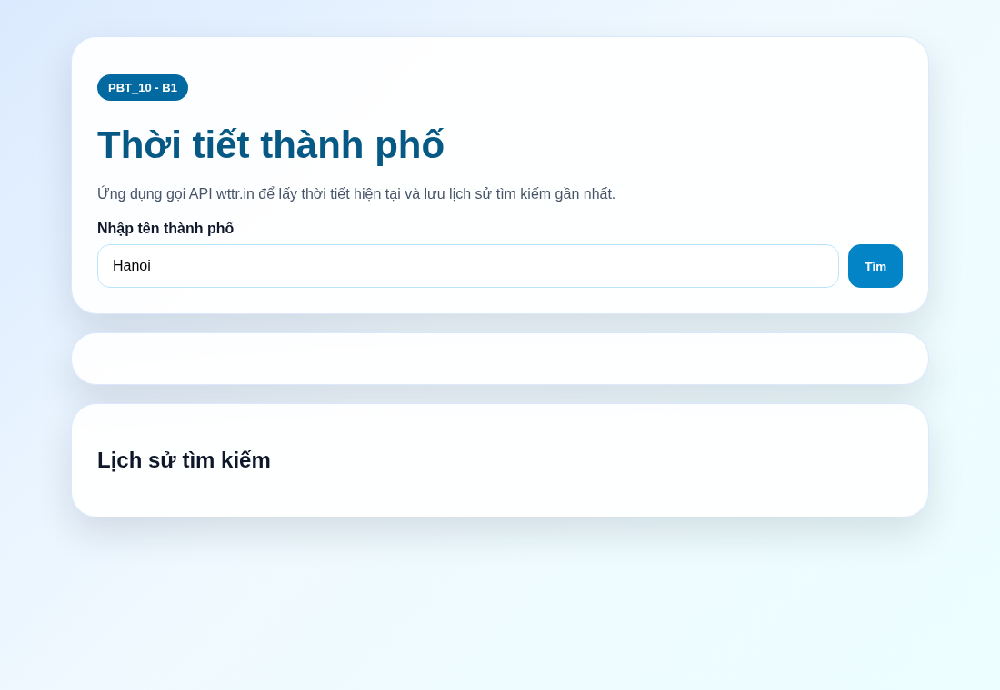
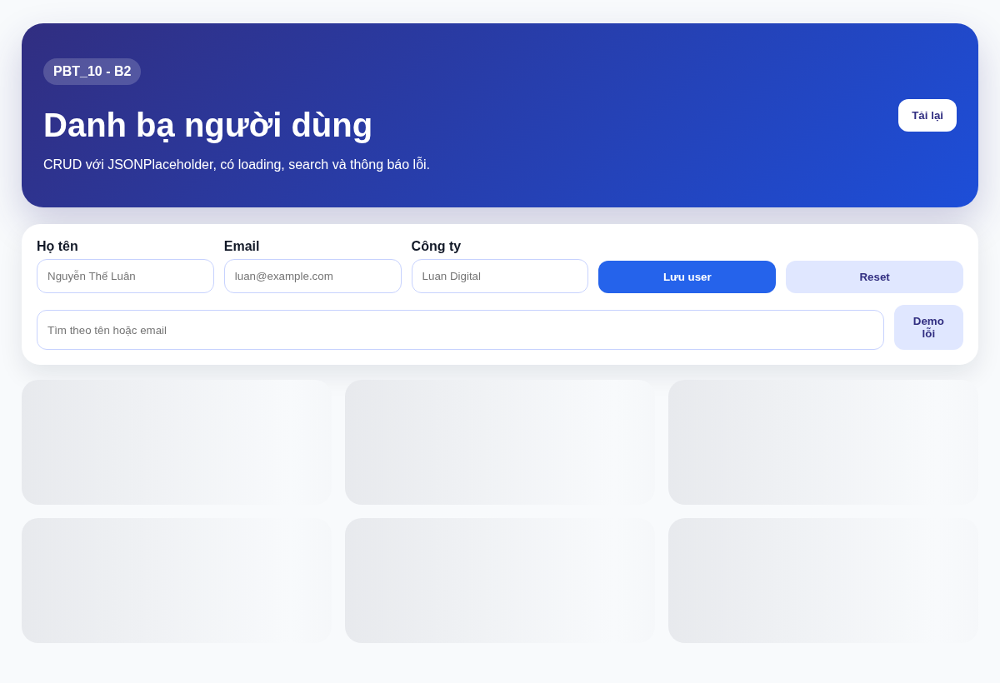
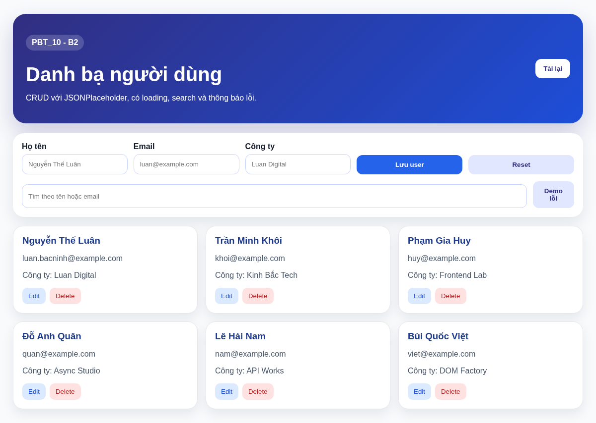
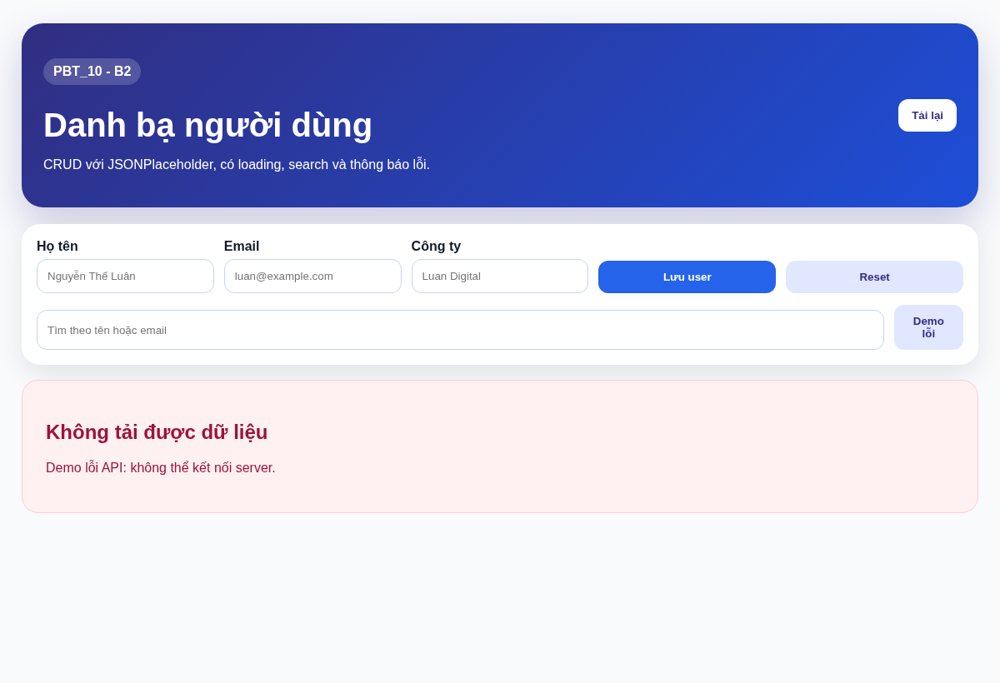
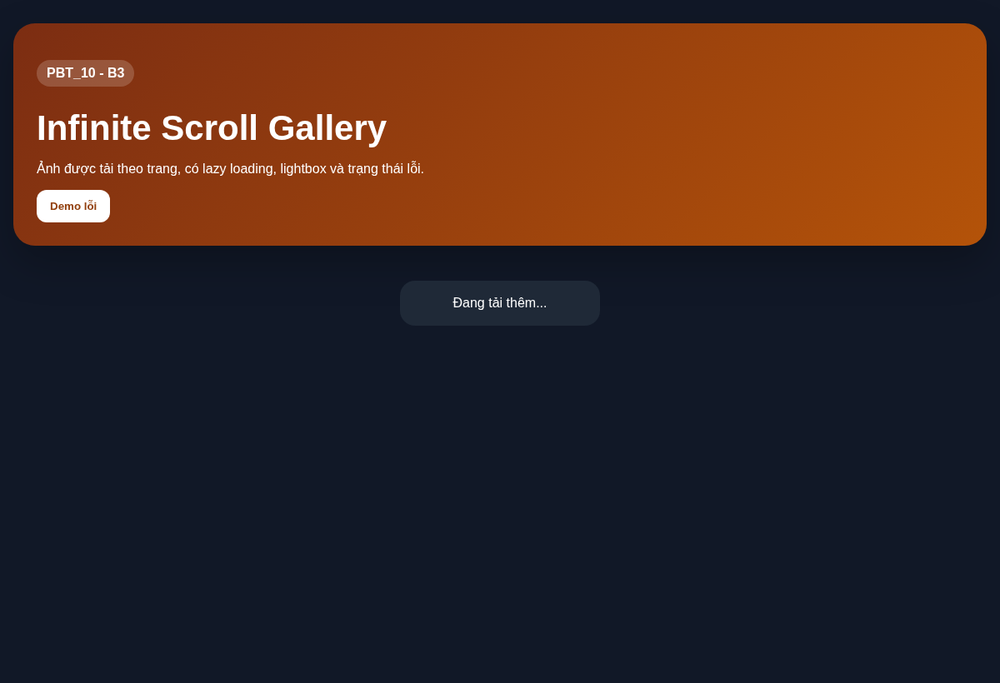
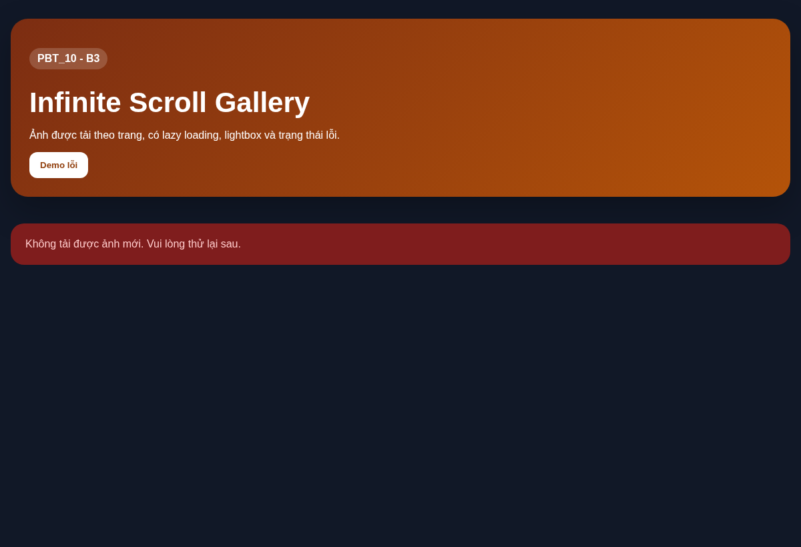
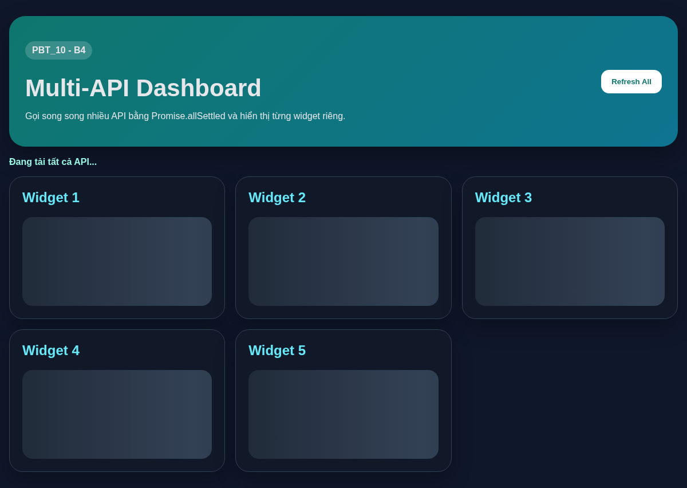
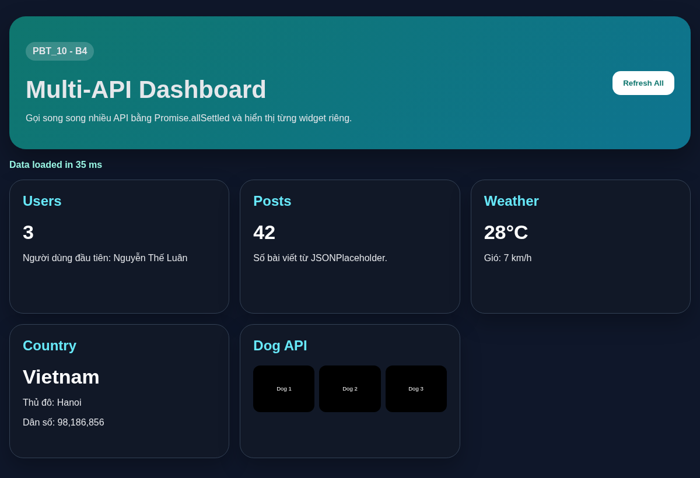
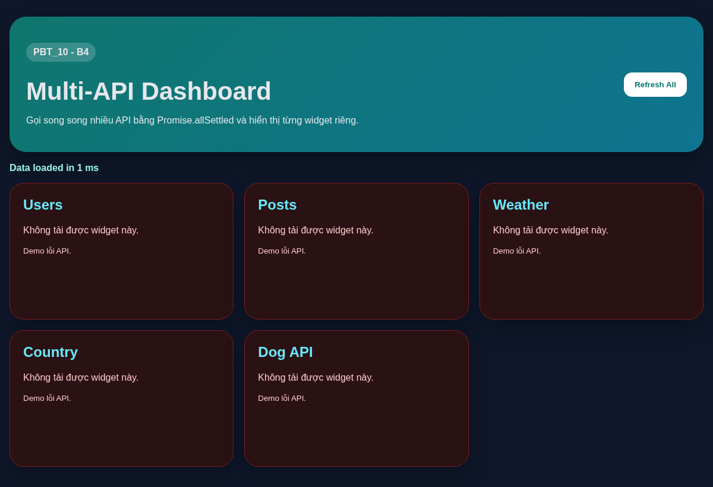

# PBT_10 - Async JavaScript & API Integration

**Sinh viên:** Nguyễn Thế Luân  
**Quê quán:** Bắc Ninh

---

## PHẦN A - KIỂM TRA ĐỌC HIỂU

### Câu A1 - Sync vs Async

Thứ tự output dự đoán:

```text
1 - Start
4 - End
3 - Promise
6 - Promise 2
2 - Timeout 0ms
7 - Nested timeout
5 - Timeout 100ms
```

Giải thích:

JavaScript chạy code đồng bộ trước, nên `console.log("1 - Start")` và `console.log("4 - End")` được in ra ngay. Các callback trong `Promise.resolve().then(...)` được đưa vào Microtask Queue, còn `setTimeout(...)` được đưa vào Macrotask Queue.

Sau khi Call Stack trống, Event Loop ưu tiên chạy toàn bộ Microtask Queue trước Macrotask Queue. Vì vậy `3 - Promise` và `6 - Promise 2` chạy trước các `setTimeout`. Trong Promise 2 có tạo thêm `setTimeout` mới nên `7 - Nested timeout` được đưa vào hàng đợi macrotask sau timeout 0ms đầu tiên. Cuối cùng `5 - Timeout 100ms` chạy sau vì có thời gian chờ 100ms.

---

### Câu A2 - Fetch API

```javascript
async function getData() {
    try {
        const response = await fetch("https://api.example.com/data");
        
        if (!response.ok) {
            throw new Error(`HTTP ${response.status}`);
        }
        
        const data = await response.json();
        return data;
    } catch (error) {
        console.error("Failed:", error.message);
        return null;
    }
}
```

`await fetch(...)` dùng để chờ request gửi đến server và nhận response. `fetch` trả về một Promise, nếu không dùng `await` thì biến `response` sẽ chưa có dữ liệu thật để xử lý.

`response.ok` là `true` khi HTTP status nằm trong khoảng 200-299. Nó sẽ là `false` với các mã lỗi như `404 Not Found`, `500 Internal Server Error`, `429 Too Many Requests`.

`response.json()` cũng cần `await` vì việc đọc body response và parse JSON là thao tác bất đồng bộ. Nếu không `await`, biến `data` sẽ là Promise chứ chưa phải object/array thật.

`try...catch` có thể bắt lỗi mất mạng, lỗi CORS, lỗi server không phản hồi, lỗi parse JSON. Riêng lỗi HTTP như 404 hoặc 500 không tự rơi vào `catch`, nên cần tự kiểm tra `response.ok` và `throw new Error(...)`.

---

### Câu A3 - Promise States

Sơ đồ trạng thái Promise:

```text
                 ┌──────────────┐
                 │   Pending    │
                 └──────┬───────┘
                        │
        ┌───────────────┴───────────────┐
        │                               │
        ▼                               ▼
┌──────────────┐                ┌──────────────┐
│  Fulfilled   │                │   Rejected   │
│  Thành công  │                │    Thất bại  │
└──────────────┘                └──────────────┘
```

Callback Hell là tình trạng nhiều callback lồng nhau quá sâu, làm code khó đọc, khó debug và khó xử lý lỗi.

Ví dụ callback hell 4 cấp:

```javascript
getUser(1, function(user) {
    getOrders(user.id, function(orders) {
        getOrderDetail(orders[0].id, function(detail) {
            getPayment(detail.paymentId, function(payment) {
                console.log(payment);
            });
        });
    });
});
```

Refactor bằng async/await:

```javascript
async function loadPayment() {
    try {
        const user = await getUser(1);
        const orders = await getOrders(user.id);
        const detail = await getOrderDetail(orders[0].id);
        const payment = await getPayment(detail.paymentId);
        console.log(payment);
    } catch (error) {
        console.error("Có lỗi:", error.message);
    }
}
```

---

## PHẦN B - MINH CHỨNG KẾT QUẢ THỰC HÀNH

### Bài B1 - Weather App

Trạng thái loading:


Trạng thái success:



Trạng thái error:


---

### Bài B2 - User Directory CRUD

Trạng thái loading:



Trạng thái success:



Trạng thái error:



---

### Bài B3 - Infinite Scroll Gallery

Trạng thái loading:



Trạng thái success:


Trạng thái error:



---

### Bài B4 - Multi-API Dashboard

Trạng thái loading:



Trạng thái success:



Trạng thái error:



---

## PHẦN C - PHÂN TÍCH

### Câu C1 - Error Handling Strategy

Khi xây dựng app E-Commerce gọi nhiều API, cần xử lý lỗi theo từng nhóm để người dùng hiểu chuyện gì đang xảy ra và app không bị treo.

#### 1. Network errors

Network error xảy ra khi người dùng mất mạng, DNS lỗi, server không phản hồi hoặc request bị chặn. Cách xử lý là hiển thị thông báo dễ hiểu, không để giao diện trắng, có nút thử lại và có thể dùng dữ liệu cache gần nhất nếu có.

```javascript
async function loadProducts() {
    try {
        showLoading();
        const res = await fetch("https://api.example.com/products");
        const data = await res.json();
        renderProducts(data);
    } catch (error) {
        showError("Không thể kết nối mạng. Vui lòng kiểm tra Internet và thử lại.");
    }
}
```

#### 2. API errors

Với API errors, cần kiểm tra `response.ok` và xử lý theo từng status code.

```javascript
function handleApiStatus(status) {
    if (status === 404) {
        return "Không tìm thấy dữ liệu yêu cầu.";
    }
    if (status === 429) {
        return "Bạn gửi quá nhiều yêu cầu. Vui lòng thử lại sau.";
    }
    if (status >= 500) {
        return "Máy chủ đang gặp lỗi. Vui lòng thử lại sau.";
    }
    return "Có lỗi xảy ra khi gọi API.";
}

async function request(url) {
    const res = await fetch(url);
    if (!res.ok) {
        throw new Error(handleApiStatus(res.status));
    }
    return await res.json();
}
```

#### 3. Timeout

Timeout dùng để tránh trường hợp API chậm quá lâu làm người dùng phải chờ mãi.

```javascript
async function fetchWithTimeout(url, ms = 10000) {
    const controller = new AbortController();
    const timer = setTimeout(() => controller.abort(), ms);

    try {
        const response = await fetch(url, { signal: controller.signal });
        if (!response.ok) {
            throw new Error(`HTTP ${response.status}`);
        }
        return await response.json();
    } finally {
        clearTimeout(timer);
    }
}
```

#### 4. Retry logic

Retry nên dùng cho lỗi mạng tạm thời. Không nên retry vô hạn vì có thể làm server bị quá tải.

```javascript
async function fetchWithRetry(url, maxRetries = 3) {
    let lastError;

    for (let attempt = 1; attempt <= maxRetries; attempt++) {
        try {
            return await fetchWithTimeout(url, 10000);
        } catch (error) {
            lastError = error;
            if (attempt === maxRetries) break;
            await new Promise(resolve => setTimeout(resolve, attempt * 1000));
        }
    }

    throw lastError;
}
```

---

### Câu C2 - Promise.all vs Promise.allSettled vs Promise.race vs Promise.any

| Method | Khi nào resolve? | Khi nào reject? | Use case |
|--------|------------------|-----------------|----------|
| `Promise.all()` | Khi tất cả Promise đều fulfilled | Khi chỉ cần một Promise rejected | Dùng khi tất cả dữ liệu đều bắt buộc phải có |
| `Promise.allSettled()` | Khi tất cả Promise đã kết thúc, dù thành công hay thất bại | Hầu như không reject vì luôn trả trạng thái từng Promise | Dashboard nhiều widget, một API lỗi không làm hỏng toàn trang |
| `Promise.race()` | Khi Promise đầu tiên kết thúc thành công | Khi Promise đầu tiên kết thúc thất bại | Timeout request hoặc lấy kết quả phản hồi nhanh nhất |
| `Promise.any()` | Khi có Promise đầu tiên fulfilled | Khi tất cả Promise đều rejected | Gọi nhiều mirror server, lấy server đầu tiên thành công |

Ví dụ `Promise.all()`:

```javascript
async function loadCheckoutPage() {
    const [cart, profile, shipping] = await Promise.all([
        fetch("/api/cart").then(r => r.json()),
        fetch("/api/profile").then(r => r.json()),
        fetch("/api/shipping-methods").then(r => r.json())
    ]);

    renderCheckout(cart, profile, shipping);
}
```

Ví dụ `Promise.allSettled()`:

```javascript
async function loadHomeDashboard() {
    const results = await Promise.allSettled([
        fetch("/api/orders").then(r => r.json()),
        fetch("/api/weather").then(r => r.json()),
        fetch("/api/news").then(r => r.json())
    ]);

    results.forEach((result, index) => {
        if (result.status === "fulfilled") {
            renderWidget(index, result.value);
        } else {
            renderWidgetError(index, result.reason.message);
        }
    });
}
```

Ví dụ `Promise.race()`:

```javascript
async function fetchProductWithTimeout() {
    const timeout = new Promise((_, reject) => {
        setTimeout(() => reject(new Error("Request quá thời gian")), 5000);
    });

    return Promise.race([
        fetch("/api/products").then(r => r.json()),
        timeout
    ]);
}
```

Ví dụ `Promise.any()`:

```javascript
async function fetchFromMirrorServers() {
    const data = await Promise.any([
        fetch("https://mirror1.example.com/products").then(r => r.json()),
        fetch("https://mirror2.example.com/products").then(r => r.json()),
        fetch("https://mirror3.example.com/products").then(r => r.json())
    ]);

    return data;
}
```
